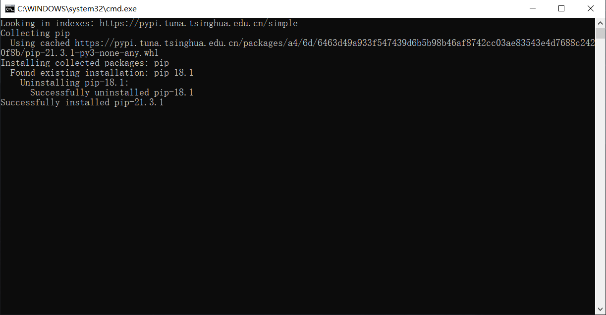
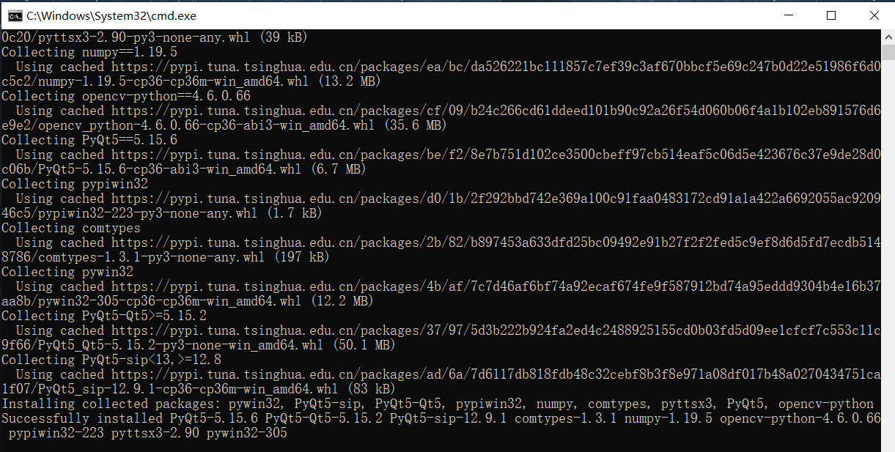
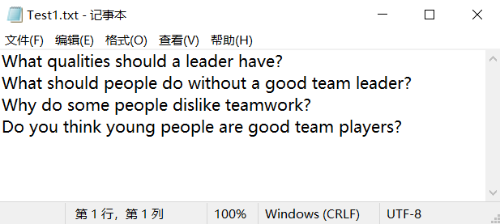

# IELTS口语TTS平台

前置需求：

1. 一台windows系统电脑和网络连接（方便环境配置）
2. Python3.x

# 安装步骤

### step1 解压


### step2 双击init.bat



出现以上类似字符，表示虚拟环境初始化已完成，本命令行会自动关闭。

### step3 双击init_requirements.bat



出现以上类似字符，表示虚拟环境python函数包已配置完毕，本命令行会自动关闭。

### step4 双击start.bat打开程序


# 主要功能介绍

- IELTS模拟考试：雅思口语第1部分->第2部分->第3部分
- IELTS PART1：雅思口语第1部分随机抽取10题，限时30s
- IELTS PART1：雅思口语第2部分随机抽取一题，限时做笔记60s，限时回答120s
- IELTS PART3：雅思口语第3部分随机抽取，限时30s
- 自定义口语测试：一问一答口语模拟，限时30s
- 雅思王听力：2024版《雅思王听力》第三、四、五、十一章节听写
- 帮助：打开帮助界面（目前版本废弃）


# 其他

### 自定义配置路径：

- **语音路径：** IELTS\Plugins\Public\settings\speaker.json
- **插件路径：** IELTS\Plugins\settings\speaker.json
- **题库路径：**
  - IELTS1：IELTS\Plugins\Public\corpus\IELTS1\Test.txt
  - IELTS2：IELTS\Plugins\Public\corpus\IELTS2\Test{num}.txt
  - IELTS3：IELTS\Plugins\Public\corpus\IELTS3\Test{num}.txt
  - 自定义口语测试题库：IELTS\Plugins\Public\corpus\QuickTest\Test.txt

### 语音配置文件：

```json
{
  "volume": 0.8,
  "rate": 120,
  "voice": 3
}
```

Q 如何调整音量、语速和合成器？

- step1 打开本文件夹相对路径settings/speaker.json文件；

- step2 更改音量（volume）；更改语速 （rate）； 更改合成器 （voice）
- step3 重启应用。

说明：volume值在0.0-1.0；rate：200代表2倍速；voice合成器数量与配置各电脑不同，通常0-3。

### 插件配置文件：

```json
{
  "IELTS": {
    "Name": "IELTS",
    "Module": "Demo",
    "Action": "clicked",
    "Button_name": "IELTSButton",
    "Button_text": "IELTS模拟测试"
  },
  "IELTS1": {
    "Name": "IELTS1",
    "Module": "Demo",
    "Action": "clicked",
    "Button_name": "IELTS1Button",
    "Button_text": "IELTS Part1"
  },
  "IELTS2": {
    "Name": "IELTS2",
    "Module": "Demo",
    "Action": "clicked",
    "Button_name": "IELTS2Button",
    "Button_text": "IELTS Part2"
  },
  "IELTS3": {
    "Name": "IELTS3",
    "Module": "Demo",
    "Action": "clicked",
    "Button_name": "IELTS3Button",
    "Button_text": "IELTS Part3"
  },
  "QuickTest": {
    "Name": "OralTest",
    "Module": "Demo",
    "Action": "clicked",
    "Button_name": "OralTestButton",
    "Button_text": "自定义口语测试"
  },
  "Help": {
    "Name": "helpBook",
    "Module": "Demo",
    "Action": "clicked",
    "Button_name": "HelpButton",
    "Button_text": "帮助"
  }
}
```

以"帮助"界面为例，

```json
{
  "Help": {
    "Name": "helpBook",
    "Module": "Demo",
    "Action": "clicked",
    "Button_name": "HelpButton",
    "Button_text": "帮助"
  }
}
```

Key："Help"表示IELTS\Plugins\Help.py文件

Value：

- "Module"="Demo"：表示Help.py文件主类为Demo
- "Name"="helpBook" ：在主函数中会实例化一个Help.Demo()为self.helpBook
- "Button_name"="HelpButton"：在主函数中会创建一个QButton按钮，实例化为self.HelpButton
- "Action"="clicked" ：将按钮self.helpBook的clicked（单击）信号槽连接到相关函数上，该相关函数会调用Demo().show()
- "Button_text"="帮助"： 在主函数中会将self.HelpButton显示的文字设为"帮助"

### 题库

#### IELTS PART1&自定义口语测试


以IELTS PART1为例，一行代表一个问题

#### IELTS PART2&IELTS PART3

IELTS PART2和IELTS PART3的题库文件一一对应，如：

IELTS\Plugins\Public\corpus\IELTS2\Test1.txt


对应 IELTS\Plugins\Public\corpus\IELTS3\Test1.txt



在更换题库时，需要尤其注意。
